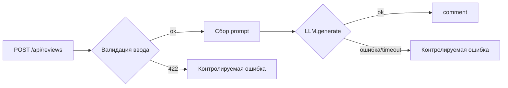

# Анализ процесса: AS IS и TO BE

## AS IS

Событие: разработчик/CI отправляет POST /api/reviews с JSON.

Участники и шаги:
- Пользователь/CI формирует JSON с полем diff (или без него по ошибке).
- FastAPI-эндпоинт create_review(payload: dict) обращается к payload["diff"]. Нет схемы/валидации.
- ReviewService формирует prompt и вызывает LLM.generate(prompt).
- Ответ LLM без проверки/ограничений возвращается как {"comment": str}.

Задержки и точки отказа:
- При отсутствии diff — KeyError и 500.
- При исключении LLM — 500.
- Большой diff — потенциальная деградация из-за длинного prompt.

## TO BE

Минимальные изменения без смены интерфейса:
- Явная схема входа (валидация diff).
- Обработка исключений LLM.generate с контролируемым ответом.
- Техническое ограничение размера diff на уровне API.

## Разница

| Что меняется | AS IS | TO BE | Как проверим изменение |
|---|---|---|---|
| Валидация входа | Нет | 422 при отсутствии diff | POST {} => 422 вместо 500 |
| Ошибки LLM | 500 | Контролируемый ответ | Подмена LLM.generate -> контролируемая ошибка |
| Размер diff | Неограничен | Ограничение/обрезка | Большой diff => 413/422 |

## Как использовали AI

- Для чего:
- Тип промпта:
- Строка в [`prompts.md`](prompts.md):
- Что проверили и исправили сами:
 - Для чего: описать AS IS/TO BE по TRAINING_PR.diff
 - Тип промпта: master prompt (AI-reviewer)
 - Строка в [`prompts.md`](prompts.md): P1-03
 - Что проверили и исправили сами: проверяемость сценариев (описаны в checks), код не меняли в этой задаче
