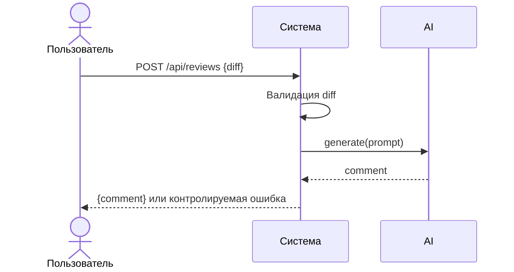

# Use cases и user stories

## Первый рабочий сценарий

**Когда** разработчик отправляет diff PR в сервис ревью, **система** валидирует вход, безопасно вызывает LLM и возвращает комментарий, **а пользователь получает** проверяемый ответ без 5xx.

Не входит в этот сценарий:

- Интеграция с GitHub (approve/merge)
- Редактирование кода по совету AI

## Use case

| Поле | Значение |
|---|---|
| Актор | Разработчик/CI |
| Триггер | Запрос POST /api/reviews с diff |
| Предусловия | Доступен сервис, валидный JSON |
| Основной результат | Возвращён комментарий LLM {"comment": str} |
| Ошибка или отказ | 422 при невалидном входе; контролируемая ошибка при сбое LLM |



## User stories и acceptance criteria

```gherkin
Feature:

  Scenario: Позитивный
    Given валидный JSON с полем diff
    When отправляем POST /api/reviews
    Then получаем 200 и {"comment": string}

  Scenario: Негативный или граничный
    Given пустой JSON {}
    When отправляем POST /api/reviews
    Then получаем 422 Unprocessable Entity

  Scenario: Сбой внешнего LLM
    Given LLM.generate выбрасывает исключение
    When отправляем POST /api/reviews с валидным diff
    Then получаем контролируемую ошибку без 500
```

## Как использовали AI

- Для чего:
- Тип промпта:
- Строка в [`prompts.md`](prompts.md):
- Что проверили и исправили сами:
 - Для чего: описать первый рабочий сценарий и критерии
 - Тип промпта: master prompt (AI-reviewer)
 - Строка в [`prompts.md`](prompts.md): P1-02, P1-03
 - Что проверили и исправили сами: сформулировали acceptance criteria как проверяемые запросы
