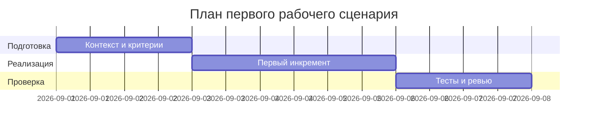

# План поставки

## Инкременты и ответственность

| Инкремент | Наблюдаемый результат | Что делает человек | Что делает AI или субагент | Проверка | Зависимости |
|---|---|---|---|---|---|
| 1 | Контекст и риск-лист | Формализует контекст и ограничения | Проверяет diff и выделяет ≤3 риска | Ссылки file:line, checks в prompts.md | TRAINING_PR.diff |
| 2 | Master prompt и контракт | Утверждает Master Prompt v1 | Сводит Context Pack и формат ответа | P1-02 в prompts.md | Инкремент 1 |
| 3 | Проверки и метрики | Подтверждает сценарии проверками | Генерирует список checks и метрик | tests_* скелеты заполнены | Инкремент 2 |

## Диаграмма Ганта

Замените даты и задачи на свой план.

## Как использовали AI

- Для чего:
- Тип промпта:
- Строка в [`prompts.md`](prompts.md):
- Что проверили и исправили сами:
 - Для чего: планирование инкрементов для первого сценария
 - Тип промпта: master prompt
 - Строка в [`prompts.md`](prompts.md): P1-03
 - Что проверили и исправили сами: согласовали зависимости и проверяемость результатов
